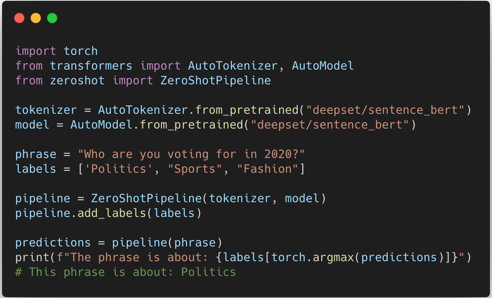

<div align="center">

<h1> Zero-Shot Classification </h1>

</div>

## Installation

```python
git clone https://github.com/pbmstrk/zeroshot.git
cd zeroshot
pip install .
```

## Building a Pipeline

```python
from transfomers import AutoModel, AutoTokenizer
from zeroshot import ZeroShotPipeline

tokenizer = AutoTokenizer.from_pretrained("deepset/sentence_bert")
model = AutoModel.from_pretrained("deepset/sentence_bert")

pipeline = ZeroShotPipeline(tokenizer, model)
pipeline.add_labels(labels)
```

Can also optionally add a projection matrix,

```python
pipeline.add_projection_matrix(projection_matrix)
```

<p align="center">
  
</p>